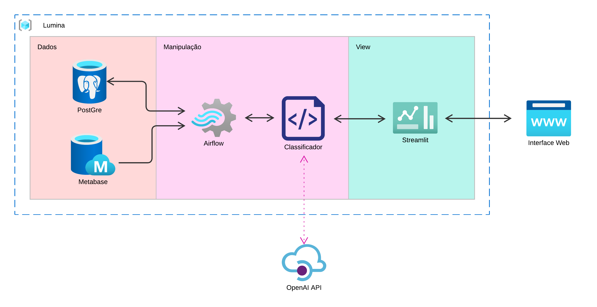

## Arquitetura

Para o desenvolvimento do nosso projeto, utilizaremos o framework Django como base.
## Diagrama de arquitetura

## Módulos arquiteturais 
A arquitetura escolhida foi uma variação da arquitetura MVC (Model - View - Controller) utilizada pelo Django.
### View
Aqui é onde os resultados são apresentados aos usuários finais:

1. **Streamlit**: Ferramenta para a construção de aplicativos web interativos em Python. Exibe visualmente os resultados da classificação de sentimentos de forma acessível e fácil de interpretar.

2. **Interface Web**: A conexão entre o Streamlit e os usuários finais. Proporciona um meio para que os usuários interajam com o sistema, visualizem análises e dados processados.
### Manipulação
Esta seção é responsável pelo processamento e preparação dos dados para análise:

1. **Airflow**: Uma plataforma de fluxo de trabalho que gerencia o fluxo de dados. Coordena a extração dos dados do banco de dados e realiza transformações necessárias, garantindo que estejam prontos para o Classificador.

2. **Classificador**: O núcleo do sistema de análise de sentimentos. Utiliza engenharia de prompt para LLM's para categorizar e atribuir sentimentos (positivo, negativo, neutro) aos dados processados. É integrado com a **OpenAI API** para utilizar modelos de linguagem na execução da análise de sentimento.
### Dados
Nessa seção, encontramos as fontes de dados primárias:

1. **PostGre**: Banco de dados PostgreSQL. É responsável por armazenar os dados brutos que serão utilizados no processo de análise junto com todos os dados que já foram analisados.

2. **Metabase**: Fonte dos dados brutos com todos os comentários e propostas do Brasil Participativo. 

## Tabela de Versionamento

| Versão | Data       | Descrição                | Autor(es)    |
|--------|------------|--------------------------|--------------|
| 1.0    | 01/12/2024 | Criação inicial          | Caio Pacheco |
| 2.0    | 10/12/2024 | Arquitetura de 3 modulos | Caio Pacheco |